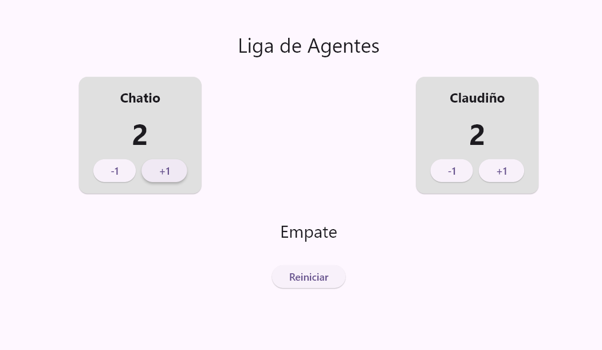
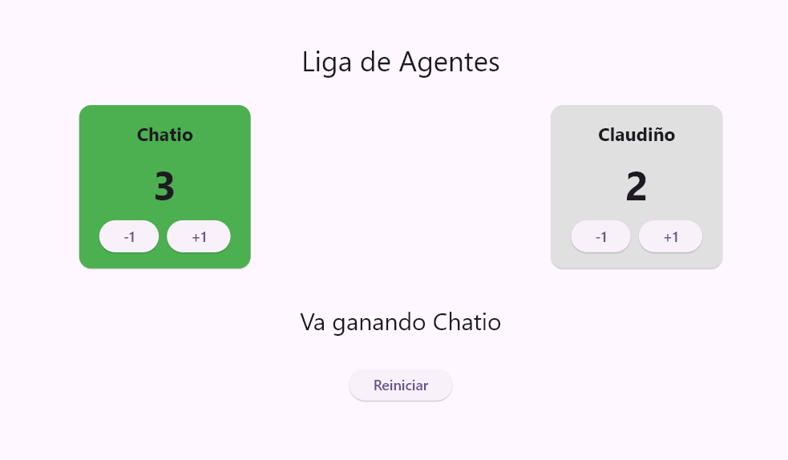

- ¿Qué hace setState cuando presiona un botón y qué ocurriría si cambia los puntos sin llamarlo?
al presionarse un botón, la función cambia el valor de la variable y le avisa a Flutter que el estado cambió. 